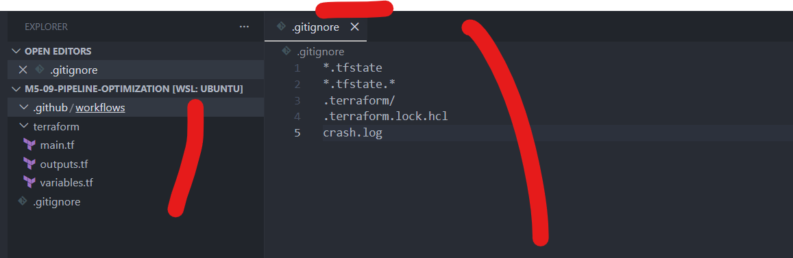
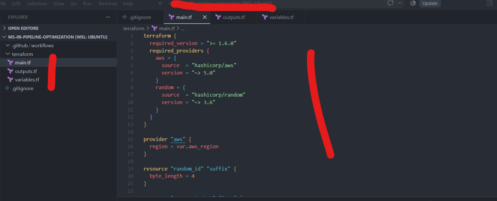
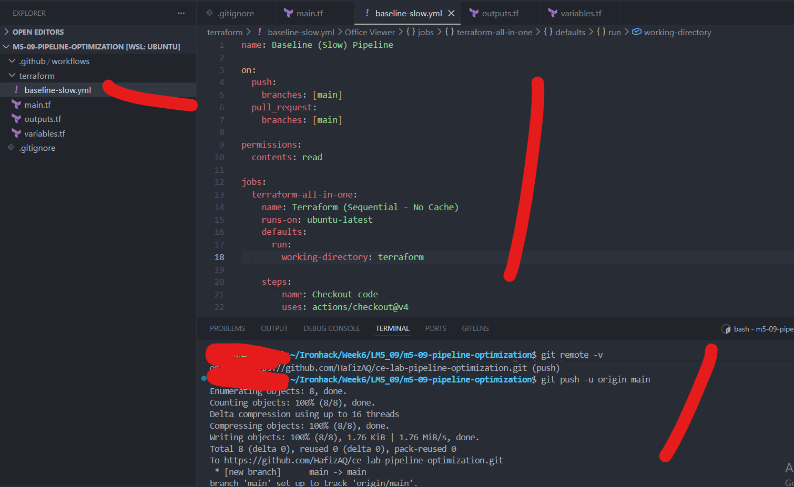
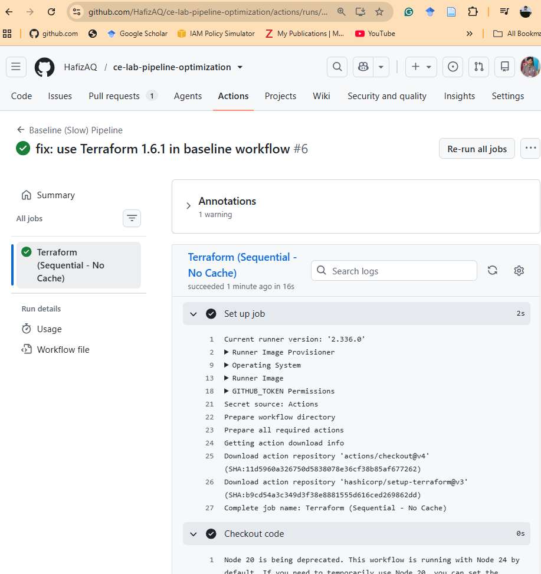
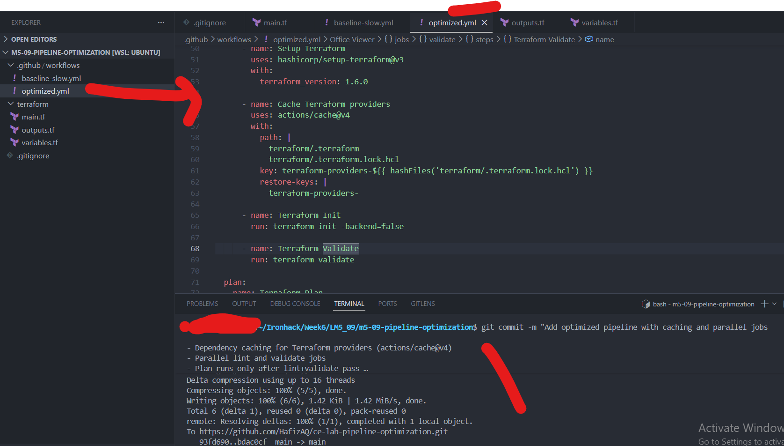
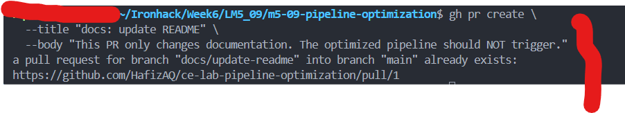
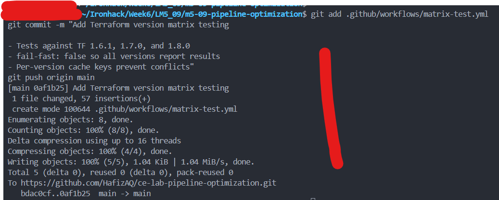
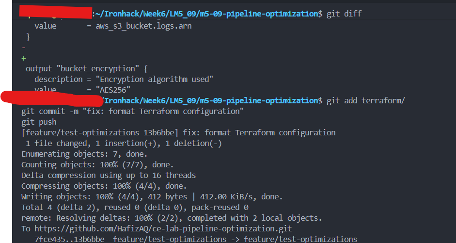
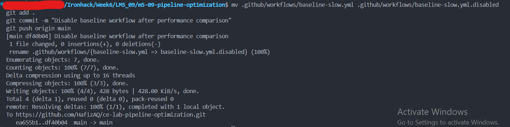

# Lab M5.09 — Pipeline Optimization

## Solution

**Repository:** `https://github.com/HafizAQ/ce-lab-pipeline-optimization`
**Lab focus:** CI/CD performance optimization, Terraform provider caching, parallel jobs, path filters, and Terraform version matrix testing.

---

## 1. Project Structure

The project was created with separate directories for GitHub Actions workflows and Terraform configuration.

```text
m5-09-pipeline-optimization/
├── .github/
│   └── workflows/
├── terraform/
│   ├── main.tf
│   ├── variables.tf
│   └── outputs.tf
└── .gitignore
└── README.md
└── SOLUTION.md
```

The `.gitignore` file excludes Terraform state, the local provider directory, the lock file, and crash logs:

```gitignore
*.tfstate
*.tfstate.*
.terraform/
.terraform.lock.hcl
crash.log
```

### Evidence



---

## 2. Terraform Configuration

The Terraform configuration defines:

- AWS provider `~> 5.0`
- Random provider `~> 3.6`
- AWS region through a variable
- A random suffix for globally unique S3 bucket naming
- S3 bucket versioning
- Server-side encryption with AES256
- Public-access blocking
- Outputs for bucket name and ARN

### `terraform/main.tf`

```hcl
terraform {
  required_version = ">= 1.6.0"

  required_providers {
    aws = {
      source  = "hashicorp/aws"
      version = "~> 5.0"
    }

    random = {
      source  = "hashicorp/random"
      version = "~> 3.6"
    }
  }
}

provider "aws" {
  region = var.aws_region
}

resource "random_id" "suffix" {
  byte_length = 4
}

resource "aws_s3_bucket" "logs" {
  bucket = "${var.project_name}-logs-${random_id.suffix.hex}"

  tags = {
    Name        = "${var.project_name}-logs"
    Environment = var.environment
    ManagedBy   = "Terraform"
  }
}

resource "aws_s3_bucket_versioning" "logs" {
  bucket = aws_s3_bucket.logs.id

  versioning_configuration {
    status = "Enabled"
  }
}

resource "aws_s3_bucket_server_side_encryption_configuration" "logs" {
  bucket = aws_s3_bucket.logs.id

  rule {
    apply_server_side_encryption_by_default {
      sse_algorithm = "AES256"
    }
  }
}

resource "aws_s3_bucket_public_access_block" "logs" {
  bucket                  = aws_s3_bucket.logs.id
  block_public_acls       = true
  block_public_policy     = true
  ignore_public_acls      = true
  restrict_public_buckets = true
}
```

### `terraform/variables.tf`

```hcl
variable "aws_region" {
  description = "AWS region for all resources"
  type        = string
  default     = "us-east-1"
}

variable "project_name" {
  description = "Project name used in resource naming"
  type        = string
  default     = "pipeline-opt"
}

variable "environment" {
  description = "Deployment environment"
  type        = string
  default     = "dev"
}
```

### `terraform/outputs.tf`

```hcl
output "bucket_name" {
  description = "Name of the logs bucket"
  value       = aws_s3_bucket.logs.id
}

output "bucket_arn" {
  description = "ARN of the logs bucket"
  value       = aws_s3_bucket.logs.arn
}
```

### Evidence



---

## 3. Baseline Slow Pipeline

A baseline workflow was created to demonstrate the CI/CD anti-patterns described in the lab:

- all Terraform steps execute sequentially in one job;
- no provider cache is used;
- the workflow runs for every push and pull request to `main`;
- only one Terraform version is tested.

### Compatibility adjustment

The original lab specifies Terraform `1.6.0`. During execution, provider installation failed with an expired OpenPGP signing-key error. The baseline was therefore updated to **Terraform 1.6.1**, while keeping the intended slow/no-cache architecture unchanged.

### `.github/workflows/baseline-slow.yml`

```yaml
name: Baseline (Slow) Pipeline

on:
  push:
    branches: [main]
  pull_request:
    branches: [main]

permissions:
  contents: read

jobs:
  terraform-all-in-one:
    name: Terraform (Sequential - No Cache)
    runs-on: ubuntu-latest

    defaults:
      run:
        working-directory: terraform

    steps:
      - name: Checkout code
        uses: actions/checkout@v4

      - name: Setup Terraform
        uses: hashicorp/setup-terraform@v3
        with:
          terraform_version: 1.6.1

      - name: Terraform Init
        run: terraform init -backend=false

      - name: Terraform Format Check
        run: terraform fmt -check -recursive

      - name: Terraform Validate
        run: terraform validate

      - name: Terraform Plan
        run: terraform plan -no-color -input=false
        env:
          AWS_ACCESS_KEY_ID: ${{ secrets.AWS_ACCESS_KEY_ID }}
          AWS_SECRET_ACCESS_KEY: ${{ secrets.AWS_SECRET_ACCESS_KEY }}
```

The AWS credentials were stored as GitHub Actions repository secrets rather than being committed to the repository.

### Evidence



A later successful Actions run shows the baseline sequential/no-cache job completing in approximately **16 seconds** in the captured run.



---

## 4. Optimized Pipeline — Caching, Parallelization, and Path Filters

The optimized workflow implements three of the main performance improvements required by the lab.

### Optimization 1 — Provider caching

`actions/cache@v4` caches the Terraform provider directory and lock file:

```yaml
- name: Cache Terraform providers
  uses: actions/cache@v4
  with:
    path: |
      terraform/.terraform
      terraform/.terraform.lock.hcl
    key: terraform-providers-${{ hashFiles('terraform/.terraform.lock.hcl') }}
    restore-keys: |
      terraform-providers-
```

The cache key is tied to the lock-file hash so that provider changes naturally invalidate the old cache.

### Optimization 2 — Parallel jobs

`lint` and `validate` have no dependency between them, so GitHub Actions can run them at the same time. The `plan` job waits for both:

```yaml
plan:
  needs: [lint, validate]
```

This changes the critical path from approximately:

```text
lint + validate + plan
```

to:

```text
max(lint, validate) + plan
```

### Optimization 3 — Path filtering

The optimized workflow is only triggered by Terraform changes or changes to the optimized workflow itself:

```yaml
on:
  push:
    branches: [main]
    paths:
      - "terraform/**"
      - ".github/workflows/optimized.yml"

  pull_request:
    branches: [main]
    paths:
      - "terraform/**"
      - ".github/workflows/optimized.yml"
```

This prevents documentation-only changes from consuming Terraform CI minutes.

### Core optimized workflow structure

```yaml
name: Optimized Pipeline

on:
  push:
    branches: [main]
    paths:
      - "terraform/**"
      - ".github/workflows/optimized.yml"
  pull_request:
    branches: [main]
    paths:
      - "terraform/**"
      - ".github/workflows/optimized.yml"

permissions:
  contents: read
  pull-requests: write

jobs:
  lint:
    name: Format Check
    runs-on: ubuntu-latest
    defaults:
      run:
        working-directory: terraform

    steps:
      - name: Checkout code
        uses: actions/checkout@v4

      - name: Setup Terraform
        uses: hashicorp/setup-terraform@v3
        with:
          terraform_version: 1.6.1

      - name: Terraform Format Check
        run: terraform fmt -check -recursive -diff

  validate:
    name: Validate
    runs-on: ubuntu-latest
    defaults:
      run:
        working-directory: terraform

    steps:
      - name: Checkout code
        uses: actions/checkout@v4

      - name: Setup Terraform
        uses: hashicorp/setup-terraform@v3
        with:
          terraform_version: 1.6.1

      - name: Cache Terraform providers
        uses: actions/cache@v4
        with:
          path: |
            terraform/.terraform
            terraform/.terraform.lock.hcl
          key: terraform-providers-${{ hashFiles('terraform/.terraform.lock.hcl') }}
          restore-keys: |
            terraform-providers-

      - name: Terraform Init
        run: terraform init -backend=false

      - name: Terraform Validate
        run: terraform validate

  plan:
    name: Terraform Plan
    needs: [lint, validate]
    runs-on: ubuntu-latest
    defaults:
      run:
        working-directory: terraform

    steps:
      - name: Checkout code
        uses: actions/checkout@v4

      - name: Setup Terraform
        uses: hashicorp/setup-terraform@v3
        with:
          terraform_version: 1.6.1

      - name: Cache Terraform providers
        uses: actions/cache@v4
        with:
          path: |
            terraform/.terraform
            terraform/.terraform.lock.hcl
          key: terraform-providers-${{ hashFiles('terraform/.terraform.lock.hcl') }}
          restore-keys: |
            terraform-providers-

      - name: Terraform Init
        run: terraform init -backend=false

      - name: Terraform Plan
        id: plan
        run: terraform plan -no-color -input=false
        env:
          AWS_ACCESS_KEY_ID: ${{ secrets.AWS_ACCESS_KEY_ID }}
          AWS_SECRET_ACCESS_KEY: ${{ secrets.AWS_SECRET_ACCESS_KEY }}

      - name: Post Plan to PR
        if: github.event_name == 'pull_request'
        uses: actions/github-script@v7
        with:
          script: |
            const output = `#### Terraform Plan 📖 \`${{ steps.plan.outcome }}\`

            <details><summary>Show Plan Output</summary>

            \`\`\`
            ${{ steps.plan.outputs.stdout }}
            \`\`\`

            </details>

            *Pushed by: @${{ github.actor }}*`;

            github.rest.issues.createComment({
              issue_number: context.issue.number,
              owner: context.repo.owner,
              repo: context.repo.repo,
              body: output
            })
```

### Evidence



---

## 5. Path Filter Test

A documentation-only branch was created to confirm that the optimized workflow does not run unnecessarily.

```bash
git checkout -b docs/update-readme
```

After adding the README change, the branch was pushed and a pull request was opened:

```bash
gh pr create \
  --title "docs: update README" \
  --body "This PR only changes documentation. The optimized pipeline should NOT trigger."
```

### Expected and observed behavior

- **Baseline (Slow) Pipeline:** runs because it has no path filter.
- **Optimized Pipeline:** does not run because only documentation changed.
- **Terraform Version Matrix:** does not run because no file under `terraform/**` changed.

This demonstrates that path filtering can avoid unnecessary CI resource consumption.

### Evidence



---

## 6. Terraform Version Matrix

A dedicated matrix workflow was added to test the Terraform configuration against multiple Terraform releases in parallel.

The original lab uses `1.6.0`, `1.7.0`, and `1.8.0`. Because `1.6.0` encountered the provider-signature problem during this lab, the working matrix uses:

- Terraform `1.6.1`
- Terraform `1.7.0`
- Terraform `1.8.0`

### `.github/workflows/matrix-test.yml`

```yaml
name: Terraform Version Matrix

on:
  pull_request:
    branches: [main]
    paths:
      - "terraform/**"

permissions:
  contents: read

jobs:
  version-test:
    name: Test (TF ${{ matrix.terraform_version }})
    runs-on: ubuntu-latest

    strategy:
      fail-fast: false
      matrix:
        terraform_version:
          - "1.6.1"
          - "1.7.0"
          - "1.8.0"

    defaults:
      run:
        working-directory: terraform

    steps:
      - name: Checkout code
        uses: actions/checkout@v4

      - name: Setup Terraform ${{ matrix.terraform_version }}
        uses: hashicorp/setup-terraform@v3
        with:
          terraform_version: ${{ matrix.terraform_version }}

      - name: Show Terraform version
        run: terraform version

      - name: Cache Terraform providers
        uses: actions/cache@v4
        with:
          path: |
            terraform/.terraform
            terraform/.terraform.lock.hcl
          key: terraform-${{ matrix.terraform_version }}-${{ hashFiles('terraform/.terraform.lock.hcl') }}
          restore-keys: |
            terraform-${{ matrix.terraform_version }}-

      - name: Terraform Init
        run: terraform init -backend=false

      - name: Terraform Validate
        run: terraform validate

      - name: Terraform Format Check
        run: terraform fmt -check -recursive
```

### Why `fail-fast: false` was used

If one Terraform version fails, the remaining versions are still allowed to complete. This gives a full compatibility picture rather than cancelling all remaining matrix jobs after the first failure.

### Why the Terraform version is part of the cache key

Each Terraform version has its own cache namespace:

```text
terraform-1.6.1-...
terraform-1.7.0-...
terraform-1.8.0-...
```

This avoids cross-version cache collisions.

### Evidence




---

## 7. Feature Branch — Full Optimization Test

A feature branch was created to make a Terraform change and trigger all Terraform-related workflows:

```bash
git checkout -b feature/test-optimizations
```

The following output was added:

```hcl
output "bucket_encryption" {
  description = "Encryption algorithm used"
  value       = "AES256"
}
```

### Formatting issue encountered

The first CI attempt reported:

```text
Terraform exited with code 3
```

from:

```bash
terraform fmt -check -recursive
```

This indicated that `outputs.tf` was not formatted according to Terraform's canonical style. The configuration was corrected locally using:

```bash
cd terraform
terraform fmt -recursive
terraform fmt -check -recursive
cd ..
```

The formatting correction was then committed and pushed:

```bash
git add terraform/
git commit -m "fix: format Terraform configuration"
git push
```

The push updated the existing feature pull request automatically.

### Evidence



---

## 8. Disable the Baseline Workflow

After the baseline behavior and timing had been captured, the deliberately inefficient baseline workflow was disabled by renaming it:

```bash
git checkout main
git pull

mv .github/workflows/baseline-slow.yml \
   .github/workflows/baseline-slow.yml.disabled

git add .
git commit -m "Disable baseline workflow after performance comparison"
git push origin main
```

Renaming the file prevents GitHub Actions from continuing to run the intentionally slow baseline pipeline and avoids wasting CI resources after the comparison is complete.

### Evidence



---

## 9. Performance and Optimization Comparison

The screenshots supplied for this solution show a successful baseline job completing in approximately **16 seconds**. An optimized total duration was not visible in the supplied screenshots, so no unsupported timing value is invented here.

| Metric             | Baseline (Slow)                    | Optimized                                                        |
| ------------------ | ---------------------------------- | ---------------------------------------------------------------- |
| Total duration     | ~16 sec in captured successful run | Depends on cache state and runner; record from final Actions run |
| Job structure      | 1 sequential job                   | `lint` + `validate` parallel, then `plan`                  |
| Provider caching   | None                               | `actions/cache@v4`                                             |
| Path filtering     | None                               | `terraform/**` and optimized workflow only                     |
| Terraform versions | Single version                     | Matrix: 1.6.1, 1.7.0, 1.8.0                                      |
| Docs-only change   | Baseline still runs                | Optimized pipeline skipped                                       |
| Cache isolation    | N/A                                | Per-lock-file and per-version keys                               |

> **Note:** The optimized workflow can be faster primarily because it avoids repeated provider downloads, overlaps independent jobs, and completely skips runs that are irrelevant to Terraform. The exact wall-clock improvement varies with GitHub-hosted runner startup time, cache hits, and network conditions.

---

## 10. Issues Encountered and Resolutions

### Issue 1 — Provider signature error with Terraform 1.6.0

Observed error:

```text
Error while installing hashicorp/aws ...
error checking signature:
openpgp: key expired
```

**Resolution:** Terraform setup was updated from `1.6.0` to `1.6.1`. The same compatibility adjustment was used in the matrix by replacing the `1.6.0` entry with `1.6.1`.

### Issue 2 — Terraform formatting check failed

Observed error:

```text
Terraform exited with code 3
```

The output identified `outputs.tf` as requiring formatting.

**Resolution:**

```bash
terraform fmt -recursive
terraform fmt -check -recursive
```

The corrected file was committed to the feature branch.

### Issue 3 — AWS authentication for `terraform plan`

The AWS provider requires credentials when Terraform evaluates the S3 resources during planning. The solution uses GitHub Actions repository secrets:

```text
AWS_ACCESS_KEY_ID
AWS_SECRET_ACCESS_KEY
```

They are injected only into the plan step:

```yaml
env:
  AWS_ACCESS_KEY_ID: ${{ secrets.AWS_ACCESS_KEY_ID }}
  AWS_SECRET_ACCESS_KEY: ${{ secrets.AWS_SECRET_ACCESS_KEY }}
```

No credential values are stored in source control.

### Issue 4 — Node.js deprecation warning

GitHub Actions displayed a Node.js deprecation warning for actions that target Node.js 20. This was a warning rather than the cause of the Terraform failures and did not prevent the successful baseline execution shown in the evidence.

---

## 11. Final Repository Structure

```text
ce-lab-pipeline-optimization/
├── .github/
│   └── workflows/
│       ├── baseline-slow.yml.disabled
│       ├── optimized.yml
│       └── matrix-test.yml
├── terraform/
│   ├── main.tf
│   ├── variables.tf
│   └── outputs.tf
├── .gitignore
├── README.md
└── SOLUTION.md
```

---

## 12. Learning Outcomes Demonstrated

This lab demonstrates the required CI/CD optimization techniques:

1. **Baseline measurement** — an intentionally inefficient sequential workflow was created and executed.
2. **Dependency caching** — Terraform providers are cached with `actions/cache@v4`.
3. **Parallelization** — formatting and validation execute independently and in parallel.
4. **Dependency ordering** — the Terraform plan waits for both quality gates using `needs: [lint, validate]`.
5. **Path filters** — documentation-only changes do not trigger the optimized Terraform workflow.
6. **Matrix testing** — multiple Terraform versions are tested in parallel.
7. **Cache isolation** — matrix cache keys include the Terraform version.
8. **Secure credentials** — AWS keys are supplied through GitHub Actions secrets rather than source code.
9. **Resource efficiency** — the baseline workflow is disabled after the comparison is complete.

---

## Conclusion

The original all-in-one Terraform workflow was converted into a more efficient CI design using caching, parallel execution, path-aware triggering, and version-matrix testing. The optimized design improves developer feedback time and avoids unnecessary GitHub Actions usage while maintaining Terraform formatting, validation, planning, and compatibility checks.
